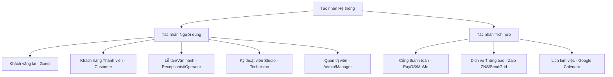

# TÀI LIỆU YÊU CẦU NGHIỆP VỤ & ĐẶC TẢ CHI TIẾT USE CASE (BRD)
## DỰ ÁN: HỆ THỐNG ĐẶT PHÒNG DUO STUDIO BOOKING

| Thông tin tài liệu | Chi tiết |
| :--- | :--- |
| **Vai trò soạn thảo** | Lead Business Analyst (6 năm kinh nghiệm phân tích hệ thống) |
| **Phiên bản** | 1.1 (Cập nhật chi tiết đặc tả) |
| **Trạng thái** | Sẵn sàng cho Phát triển & Thiết kế (Production-Ready) |
| **Phạm vi tài liệu** | Toàn bộ chức năng nghiệp vụ, phân vai tác nhân (Actors), ma trận Use Case, quy tắc nghiệp vụ (Business Rules), và đặc tả kỹ thuật chi tiết. |

---

## 1. Tổng quan & Mục tiêu Dự án (Project Overview)

### 1.1. Bối cảnh
DUO Studio vận hành chuỗi phòng quay phim, chụp ảnh, podcast chuyên nghiệp bao gồm các không gian độc bản như **Studio A (The Loft)**, **Studio B (Industrial Edge)**, và **Studio C (The Daylight Suite)**.
Quy trình hiện tại phụ thuộc nhiều vào việc tư vấn thủ công qua fanpage, dẫn đến:
- Tỷ lệ sai sót lịch trùng (Double-booking) cao.
- Khách hàng mất thời gian chờ kiểm tra tình trạng phòng và thiết bị trống.
- Khó quản lý kho thiết bị đi kèm (máy ảnh Sony FX3, đèn Profoto B10X, gimbal DJI RS3...) dẫn đến xung đột khi nhiều phòng cùng thuê một thiết bị trong cùng khung giờ.
- Khó kiểm soát doanh thu đặt cọc và chính sách hủy lịch.

### 1.2. Mục tiêu hệ thống
1. **Tự động hóa 90%** quy trình đặt phòng và thanh toán trực tuyến.
2. **Kiểm soát xung đột thiết bị thời gian thực** (Real-time Inventory Conflict Prevention).
3. **Tự động hóa thông báo** đa kênh (Zalo ZNS/SMS/Email) nhắc lịch và gửi mã QR check-in.
4. **Cấu hình giá động** (Dynamic Pricing Engine) theo giờ cao điểm/thấp điểm, cuối tuần, và sự kiện đặc biệt.

---

## 2. Xác định các Tác nhân Hệ thống (System Actors)

Hệ thống DUO Studio Booking phân cấp rõ ràng 5 nhóm tác nhân tương tác trực tiếp và các tác nhân hệ thống tích hợp:



### 2.1. Phân vai chi tiết và Quyền hạn (Role & Permissions Matrix)

| # | Tác nhân (Actor) | Mô tả vai trò | Quyền hạn chính trên hệ thống |
| :--- | :--- | :--- | :--- |
| 1 | **Khách vãng lai (Guest)** | Người dùng chưa đăng nhập truy cập vào Website. | - Xem thông tin chi tiết các phòng (Studio A, B, C) và thiết bị đi kèm.<br>- Tra cứu lịch trống thời gian thực.<br>- Đặt lịch giữ chỗ tạm thời (chờ thanh toán cọc). |
| 2 | **Khách hàng Thành viên (Customer)** | Khách hàng đã xác thực qua OTP điện thoại/Email. | - Kế thừa mọi quyền của Khách vãng lai.<br>- Quản lý lịch sử đặt phòng cá nhân.<br>- Thực hiện tự phục vụ (Self-service): Đổi ca, hủy ca đặt lịch theo chính sách hoàn cọc.<br>- Tích điểm thành viên và đánh giá phản hồi (Feedback) sau ca thuê. |
| 3 | **Nhân viên Lễ tân (Receptionist)** | Nhân viên trực tại quầy hoặc nhân viên CSKH tại chi nhánh. | - Xem Dashboard lịch trực quan (Scheduler View) thời gian thực.<br>- Check-in/Check-out cho khách bằng mã QR.<br>- Tạo booking trực tiếp tại quầy (Walk-in booking).<br>- Cập nhật trạng thái thanh toán thủ công (đối với tiền mặt hoặc chuyển khoản trực tiếp). |
| 4 | **Kỹ thuật viên (Technician)** | Đội ngũ kỹ thuật viên set up và bàn giao thiết bị phòng máy. | - Xem danh sách thiết bị cần set up theo ca trực (Setup Checklist).<br>- Cập nhật trạng thái thiết bị (Hoạt động tốt / Hỏng hóc cần sửa chữa / Đang bảo trì). |
| 5 | **Quản trị viên (Admin/Manager)** | Chủ chuỗi studio hoặc quản lý cấp cao hệ thống. | - Quản lý danh mục Phòng và Thiết bị.<br>- Cấu hình biểu giá động (Dynamic Pricing), cài đặt khung giờ vàng, giá cuối tuần.<br>- Cấu hình mã giảm giá (Promo Code).<br>- Xem báo cáo tài chính chi tiết, biểu đồ doanh thu và tỷ lệ lấp đầy phòng (Occupancy Rate). |

---

## 3. Bản đồ Chức năng Nghiệp vụ (Business Function Map)

Dưới đây là sơ đồ phân chia các Module chức năng nghiệp vụ của hệ thống:

```
[HỆ THỐNG DUO STUDIO BOOKING]
 ├── 1. Phân hệ Đặt lịch & Dịch vụ (Booking Portal)
 │    ├── Tìm kiếm & Lọc phòng trống theo thời gian thực (Real-time Search)
 │    ├── Lựa chọn dịch vụ & Thiết bị đi kèm (Add-on Selector)
 │    ├── Giữ chỗ tạm thời (Temporary Hold)
 │    └── Quản lý lịch sử đặt lịch (Self-service Portal)
 ├── 2. Phân hệ Thanh toán (Payment Integration)
 │    ├── Tạo mã QR động thanh toán cọc (PayOS / Momo QR Generator)
 │    ├── Xử lý hoàn tiền tự động (Auto-refund Engine)
 │    └── Quản lý hóa đơn điện tử (E-Invoice Creation)
 ├── 3. Phân hệ Điều phối & Lịch biểu (Operations Calendar)
 │    ├── Dashboard lịch dạng lưới thời gian (Scheduler View)
 │    ├── Kéo-thả chuyển ca & phòng (Drag-and-Drop Rescheduler)
 │    └── Quy trình Check-in/Check-out qua mã QR (QR Check-in Flow)
 ├── 4. Phân hệ Quản lý Kho Thiết bị (Inventory Management)
 │    ├── Theo dõi tồn kho khả dụng theo giờ (Hourly Stock Tracking)
 │    ├── Cơ chế chống trùng lặp thiết bị (Double-booking Prevention)
 │    └── Báo cáo trạng thái thiết bị lỗi/hỏng (Device Status Reporter)
 └── 5. Phân hệ Quản trị & Báo cáo (Admin Settings & Reports)
      ├── Cấu hình biểu giá động (Dynamic Pricing Rule Engine)
      ├── Quản lý chiến dịch khuyến mãi (Campaign & Promo Codes)
      └── Báo cáo tỷ lệ lấp đầy & Doanh số (Occupancy & Revenue Reports)
```

---

## 4. Chi tiết các Use Case Nghiệp vụ (Detailed Use Cases)

### 4.1. Ma trận Use Case (Use Case Matrix)

| Mã Use Case | Tên Use Case | Tác nhân chính | Tác nhân phụ/Hệ thống tích hợp | Mức độ ưu tiên |
| :--- | :--- | :--- | :--- | :--- |
| **UC-101** | Tìm kiếm phòng trống thời gian thực | Khách vãng lai / Khách hàng | Hệ thống | High |
| **UC-102** | Đặt phòng và chọn thiết bị (Add-ons) | Khách vãng lai / Khách hàng | Hệ thống | High |
| **UC-103** | Thanh toán cọc trực tuyến qua QR động | Khách hàng | Cổng thanh toán (PayOS / Momo) | High |
| **UC-104** | Tự phục vụ: Đổi ca hoặc Hủy đặt phòng | Khách hàng | Hệ thống | Medium |
| **UC-201** | Quản lý điều phối ca qua Scheduler | Lễ tân / Admin | Hệ thống | High |
| **UC-202** | Check-in/Check-out ca thuê qua QR | Lễ tân | Hệ thống, Dịch vụ Email/Zalo | Medium |
| **UC-301** | Cấu hình giá động và khuyến mãi | Admin / Manager | Hệ thống | High |
| **UC-302** | Quản lý kho và Cảnh báo xung đột thiết bị | Kỹ thuật viên / Admin | Hệ thống | High |

---

### 4.2. Đặc tả Chi tiết các Use Case Trọng yếu

#### UC-101: Tìm kiếm phòng trống thời gian thực (Real-time Availability Search)
*   **Mục đích**: Giúp khách hàng nhanh chóng lọc ra phòng trống phù hợp với ngày, khung giờ và nhu cầu nhân sự.
*   **Tác nhân**: Khách vãng lai, Khách hàng thành viên.
*   **Tiền điều kiện**: Hệ thống hoạt động bình thường, danh mục phòng có trạng thái `active`.
*   **Hậu điều kiện**: Hiển thị danh sách các phòng còn trống kèm đơn giá tương ứng với khung giờ đã chọn.
*   **Luồng xử lý chính (Basic Flow)**:
    1. Khách hàng truy cập trang chủ hoặc trang đặt phòng.
    2. Khách hàng nhập các tham số lọc:
        *   **Ngày thuê mong muốn**.
        *   **Khung giờ bắt đầu & Khung giờ kết thúc** (Ví dụ: 09:00 - 11:30).
        *   **Sức chứa tối đa (Capacity)** (Tùy chọn).
    3. Khách hàng nhấn nút **"Tìm kiếm phòng trống"**.
    4. Hệ thống quét bảng `bookings` để kiểm tra các phòng có lịch chồng lấn trong khoảng thời gian được chọn (sau khi đã cộng thêm **Buffer Time** 15 phút).
    5. Hệ thống trả về danh sách phòng khả dụng kèm hình ảnh, mô tả chi tiết, sức chứa, và tổng tiền phòng cơ bản (chưa bao gồm add-on).
*   **Luồng rẽ nhánh / Ngoại lệ (Alternative & Exception Flows)**:
    *   *Ngoại lệ 1 (Thời gian không hợp lệ)*: Nếu Khách chọn giờ ở quá khứ hoặc khoảng thời gian thuê nhỏ hơn 1.5 giờ (Quy tắc BR-02), hệ thống hiển thị thông báo lỗi: *"Khung giờ thuê tối thiểu là 1 giờ 30 phút. Vui lòng chọn lại."*
    *   *Ngoại lệ 2 (Không còn phòng trống)*: Nếu không có phòng nào thỏa mãn điều kiện lọc, hệ thống hiển thị thông báo: *"Rất tiếc, các phòng hiện tại đã kín lịch trong khung giờ này."* Đồng thời gợi ý các khung giờ trống gần nhất trong ngày của các phòng.

---

#### UC-102: Đặt phòng và chọn dịch vụ đi kèm (Booking & Add-ons Select)
*   **Mục đích**: Cho phép khách hàng chọn phòng, cấu hình gói thiết bị phụ trợ và nhập thông tin người đặt lịch.
*   **Tác nhân**: Khách hàng, Hệ thống.
*   **Tiền điều kiện**: Khách hàng đã thực hiện thành công UC-101 và chọn được 1 phòng cụ thể.
*   **Hậu điều kiện**: Tạo một bản ghi booking ở trạng thái `pending` và chuyển hướng đến trang thanh toán.
*   **Luồng xử lý chính (Basic Flow)**:
    1. Khách hàng click chọn phòng mong muốn từ kết quả tìm kiếm ở UC-101.
    2. Hệ thống chuyển hướng sang bước chọn **Dịch vụ/Thiết bị đi kèm (Add-ons)**.
    3. Hệ thống kiểm tra số lượng tồn kho khả dụng của từng thiết bị trong khung giờ đã chọn (ví dụ: kho có 3 máy ảnh Sony FX3, hiện tại các ca trùng giờ khác đã đặt 2 máy, thì hệ thống hiển thị số lượng tối đa khách được chọn thuê là 1 máy).
    4. Khách hàng tăng/giảm số lượng thiết bị muốn thuê thêm (Sony FX3, Profoto B10X, v.v.).
    5. Khách hàng điền thông tin liên hệ: Họ và tên, Số điện thoại, Email, Ghi chú đặc biệt.
    6. Hệ thống thực hiện tính toán chi phí (Áp dụng các quy tắc về giá cuối tuần, giờ đêm, hoặc mã giảm giá nếu khách hàng nhập).
    7. Khách hàng xác nhận thông tin và bấm **"Tiến hành đặt cọc"**.
    8. Hệ thống lưu thông tin vào bảng `bookings` và `booking_addons` với trạng thái `booking_status: pending`, đồng thời khóa tạm thời (hold) lịch phòng này trong 10 phút.
*   **Luồng rẽ nhánh / Ngoại lệ (Alternative & Exception Flows)**:
    *   *Ngoại lệ 1 (Thiết bị add-on bị hết kho đột xuất)*: Nếu giữa lúc khách hàng đang chọn add-on mà có khách khác thanh toán trước dẫn đến thiết bị hết kho, hệ thống thông báo: *"Thiết bị [Tên thiết bị] vừa hết hàng khả dụng trong khung giờ này. Vui lòng giảm số lượng hoặc chọn thiết bị thay thế."*
    *   *Ngoại lệ 2 (Mã giảm giá không hợp lệ)*: Nếu khách hàng nhập mã giảm giá hết hạn hoặc không đủ điều kiện áp dụng, hệ thống báo lỗi đỏ dưới ô input mã giảm giá và tính toán lại theo giá gốc.

---

#### UC-103: Thanh toán cọc trực tuyến qua QR động (Payment Integration)
*   **Mục đích**: Tự động hóa việc nhận tiền đặt cọc và xác nhận lịch đặt phòng ngay lập tức không qua nhân sự duyệt tay.
*   **Tác nhân**: Khách hàng, Cổng thanh toán (PayOS/Momo), Hệ thống.
*   **Tiền điều kiện**: Trạng thái booking hiện tại là `pending` và lịch phòng đang được giữ chỗ tạm thời.
*   **Hậu điều kiện**: Trạng thái booking chuyển sang `confirmed`, hệ thống tự động gửi xác nhận qua Email/Zalo ZNS kèm mã QR Check-in.
*   **Luồng xử lý chính (Basic Flow)**:
    1. Hệ thống gọi API Cổng thanh toán (ví dụ: PayOS) để tạo Link thanh toán chứa thông tin: Số tiền đặt cọc (50% hoặc 100% tổng hóa đơn), Nội dung chuyển khoản định danh (Ví dụ: `DUOBOOKING 10482`).
    2. Hệ thống hiển thị giao diện thanh toán gồm: Mã QR chuyển khoản ngân hàng động (VietQR), Số tiền chính xác đến hàng đơn vị, Nội dung chuyển khoản chính xác, và đồng hồ đếm ngược 10 phút.
    3. Khách hàng mở ứng dụng Ngân hàng/Ví điện tử quét mã QR và xác nhận chuyển tiền.
    4. Cổng thanh toán xử lý giao dịch thành công, gửi webhook (IPN callback) về API của hệ thống DUO Studio.
    5. Hệ thống nhận webhook, đối soát khớp mã giao dịch và số tiền.
    6. Hệ thống chuyển đổi trạng thái:
        *   `payment_status` -> `partially_paid` (hoặc `fully_paid` tùy cấu hình cọc).
        *   `booking_status` -> `confirmed`.
    7. Hệ thống tự động đẩy thông tin lịch đặt sang Google Calendar của Studio để nhân viên chuẩn bị.
    8. Hệ thống gọi dịch vụ gửi Email & SMS Zalo ZNS để xác nhận thành công tới khách hàng kèm file vé chứa thông tin phòng và **mã QR check-in**.
*   **Luồng rẽ nhánh / Ngoại lệ (Alternative & Exception Flows)**:
    *   *Ngoại lệ 1 (Quá 10 phút không thanh toán)*: Nếu đồng hồ đếm ngược về 0 mà hệ thống chưa nhận được webhook thanh toán thành công, hệ thống tự động hủy booking (`booking_status: cancelled`), mở khóa lịch phòng và thiết bị trống để người khác đặt.
    *   *Ngoại lệ 2 (Thanh toán sai số tiền)*: Nếu khách hàng chuyển khoản thủ công không quét QR dẫn đến sai số tiền (thiếu tiền cọc), hệ thống giữ trạng thái `pending` và gửi cảnh báo tới nhân viên Lễ tân để kiểm tra đối soát thủ công.

---

#### UC-104: Tự phục vụ: Đổi ca hoặc Hủy lịch đặt phòng (Rescheduling / Cancellation)
*   **Mục đích**: Cho phép khách hàng tự thao tác đổi thời gian hoặc hủy phòng mà không cần gọi hotline, áp dụng chính sách phạt tiền cọc tự động để giảm tải vận hành.
*   **Tác nhân**: Khách hàng, Hệ thống, Admin (nếu cần phê duyệt hoàn tiền).
*   **Tiền điều kiện**: Lịch đặt phòng ở trạng thái `confirmed`. Khách hàng truy cập qua Link quản lý booking được gửi trong Email xác nhận.
*   **Hậu điều kiện**: Lịch đặt được cập nhật khung giờ mới (đối với đổi ca) hoặc giải phóng phòng và tạo yêu cầu hoàn cọc (nếu hủy lịch).
*   **Luồng xử lý chính (Basic Flow - Hủy ca)**:
    1. Khách hàng truy cập trang quản lý đặt lịch cá nhân bằng Mã Booking và mã OTP gửi qua điện thoại/email.
    2. Khách hàng nhấn chọn **"Hủy lịch đặt phòng"**.
    3. Hệ thống tính toán khoảng thời gian từ **Thời điểm hiện tại** đến **Thời điểm bắt đầu ca thuê** (Delta T):
        *   **Nếu Delta T > 24 giờ**: Hệ thống hiển thị thông báo hoàn cọc 100% (Quy tắc BR-03).
        *   **Nếu 12 giờ <= Delta T <= 24 giờ**: Hệ thống hiển thị thông báo hoàn cọc 50% (phạt 50%).
        *   **Nếu Delta T < 12 giờ**: Hệ thống cảnh báo mất 100% tiền cọc và không được hoàn tiền.
    4. Khách hàng xác nhận đồng ý với điều khoản hủy lịch.
    5. Hệ thống cập nhật trạng thái `booking_status: cancelled`.
    6. Hệ thống giải phóng phòng và thiết bị add-on để đưa lại vào kho khả dụng.
    7. Hệ thống tự động tạo một lệnh yêu cầu hoàn tiền (`refund_requests`) gửi đến tài khoản quản lý của Admin để thực hiện nhấn nút duyệt chi qua cổng PayOS/Momo.
*   **Luồng rẽ nhánh / Ngoại lệ (Alternative & Exception Flows - Đổi ca)**:
    *   *Trường hợp đổi ca*: Khách hàng chọn **"Đổi khung giờ/Ngày thuê"**:
        1. Hệ thống yêu cầu chọn Ngày và Giờ mới mong muốn.
        2. Hệ thống kiểm tra phòng đó và các add-on đã đặt trong ca cũ có khả dụng trong ca mới hay không.
        3. Nếu khả dụng: Cho phép đổi. Hệ thống tính toán chênh lệch giá (nếu đổi từ ngày thường sang cuối tuần, khách hàng phải thanh toán thêm phần chênh lệch qua QR Code trước khi hệ thống cập nhật ca mới).
        4. Nếu không khả dụng: Báo lỗi và gợi ý khách hàng chọn ca khác hoặc giữ nguyên ca cũ.

---

#### UC-201: Điều hành lịch đặt phòng trực quan (Interactive Schedule Dashboard)
*   **Mục đích**: Cung cấp giao diện Scheduler trực quan dạng cột/dòng thời gian để Lễ tân và Admin có cái nhìn tổng quan và thực hiện thao tác nhanh.
*   **Tác nhân**: Lễ tân, Quản trị viên (Admin).
*   **Tiền điều kiện**: Lễ tân/Admin đăng nhập thành công vào trang quản lý (Host Portal).
*   **Hậu điều kiện**: Cập nhật trực quan trạng thái đặt phòng trên bảng điều khiển.
*   **Luồng xử lý chính (Basic Flow)**:
    1. Nhân viên truy cập phân hệ **"Lịch điều hành" (Calendar Scheduler)**.
    2. Hệ thống hiển thị biểu đồ Gantt-style hoặc Lịch lưới (các hàng ngang là các Studio A, B, C; các cột dọc là các khung giờ trong ngày). Các block màu đại diện cho các booking tương ứng với trạng thái (Xanh lá: Confirmed, Xanh dương: Checked-in, Xám: Completed, Vàng: Pending, Đỏ: Blocked/Maintenance).
    3. Nhân viên click vào một block booking để xem nhanh: Tên khách hàng, SĐT, danh sách thiết bị thuê kèm, tổng tiền và trạng thái thanh toán.
    4. Trong trường hợp cần thay đổi gấp phòng hoặc giờ cho khách (có thỏa thuận trước), Admin thực hiện kéo thả block booking từ hàng phòng này sang phòng khác, hoặc co giãn block để thay đổi giờ bắt đầu/kết thúc.
    5. Hệ thống tự động chạy ngầm kiểm tra:
        *   Phòng mới có bị trùng lịch trong khung giờ đó không?
        *   Các thiết bị add-on của booking đó có đủ số lượng khả dụng ở phòng mới/giờ mới không?
    6. Nếu đạt yêu cầu, hệ thống cập nhật Database, tự động gửi Zalo/Email thông báo lịch thay đổi tới khách hàng và cập nhật Google Calendar.
*   **Luồng rẽ nhánh / Ngoại lệ (Alternative & Exception Flows)**:
    *   *Ngoại lệ 1 (Xung đột khi kéo thả)*: Nếu vị trí thả block bị trùng lịch hoặc thiếu thiết bị add-on, hệ thống sẽ rung nhẹ khối thông tin, đẩy block về vị trí cũ và hiển thị thông báo: *"Không thể chuyển lịch. Phát hiện xung đột thiết bị [Tên thiết bị] hoặc phòng đã có người đặt trong thời gian này."*

---

#### UC-301: Cấu hình giá động (Dynamic Pricing Configuration)
*   **Mục đích**: Tối ưu hóa doanh thu bằng cách tự động tăng giá vào giờ cao điểm, cuối tuần hoặc giảm giá giờ vàng.
*   **Tác nhân**: Quản trị viên (Admin).
*   **Tiền điều kiện**: Admin đăng nhập thành công.
*   **Hậu điều kiện**: Quy tắc giá mới được áp dụng ngay lập tức khi khách hàng đặt phòng trực tuyến.
*   **Luồng xử lý chính (Basic Flow)**:
    1. Admin truy cập mục **"Cấu hình giá phòng & Quy tắc giá động"**.
    2. Hệ thống hiển thị bảng giá gốc của các phòng (Ví dụ: Studio A là 450,000đ/giờ).
    3. Admin thiết lập quy tắc giá động mới bằng cách nhập các tham số:
        *   **Tên quy tắc**: (Ví dụ: "Phụ thu Cuối tuần").
        *   **Loại áp dụng**: Theo Ngày trong tuần (Thứ 7, Chủ Nhật) hoặc Theo Khung Giờ (Sau 22:00 tối đến 06:00 sáng).
        *   **Giá trị điều chỉnh**: Cộng thêm số tiền cố định (ví dụ: +50,000đ/giờ) hoặc tăng theo tỷ lệ % (ví dụ: +10% giá gốc).
    4. Admin nhấn **"Lưu quy tắc"**.
    5. Hệ thống ghi nhận quy tắc vào cơ sở dữ liệu. Khi người dùng thực hiện tính toán giá ở UC-102, hệ thống sẽ tự động quét qua các quy tắc này để áp dụng mức giá chính xác theo thời gian thực.
*   **Luồng rẽ nhánh / Ngoại lệ (Alternative & Exception Flows)**:
    *   *Trường hợp trùng lặp quy tắc*: Nếu có 2 quy tắc giá động cùng áp dụng lên 1 thời điểm (ví dụ: Vừa là cuối tuần vừa là khung giờ đêm), hệ thống sẽ áp dụng quy tắc có mức độ ưu tiên cao hơn hoặc cộng dồn lũy kế theo cấu hình (ví dụ: Giá gốc + phụ thu cuối tuần + phụ thu giờ đêm). Quy định này phải được hiển thị rõ ràng cho Admin khi tạo quy tắc.

---

## 5. Quy tắc Nghiệp vụ Đặc thù (Business Rules - BR)

Để hệ thống vận hành tự động trơn tru không gặp lỗi logic, các quy tắc sau **BẮT BUỘC** phải được hiện thực hóa ở mức code (Database Constraints & Backend Validations):

```
+---------------------------------------------------------------------------------+
|                               BUSINESS RULES (BR)                               |
+---------------------------------------------------------------------------------+
|                                                                                 |
|  [BR-01: BUFFER TIME]                                                           |
|  Mỗi lượt đặt phòng phải tự động cộng thêm 15 phút dọn dẹp (buffer time)        |
|  sau khi kết thúc để ngăn chặn đặt ca tiếp theo sát sườn.                       |
|                                                                                 |
|  [BR-02: MINIMUM DURATION]                                                      |
|  Thời lượng thuê tối thiểu cho mỗi booking là 1.5 giờ (90 phút).                |
|                                                                                 |
|  [BR-03: CANCELLATION & REFUND POLICY]                                          |
|  - Hủy > 24h trước giờ bắt đầu: Hoàn 100% tiền đặt cọc.                         |
|  - Hủy từ 12h - 24h: Hoàn 50% tiền cọc (Phạt 50%).                              |
|  - Hủy < 12h: Mất 100% tiền đặt cọc.                                            |
|                                                                                 |
|  [BR-04: TEMPORARY HOLD TIMEOUT]                                                |
|  Lịch đặt phòng và thiết bị add-on chỉ được giữ tạm (pending) trong 10 phút.    |
|  Sau 10 phút không có tín hiệu thanh toán thành công, hệ thống tự động hủy.    |
|                                                                                 |
|  [BR-05: REAL-TIME INVENTORY CHECK]                                             |
|  Số lượng thiết bị add-on khả dụng = [Tổng kho thiết bị] - [Tổng đã thuê trùng] |
|  Không được cho phép đặt vượt số lượng khả dụng này trong mọi trường hợp.       |
|                                                                                 |
+---------------------------------------------------------------------------------+
```

### Chi tiết các Quy tắc Nghiệp vụ:

1.  **BR-01 (Buffer Time - Thời gian đệm)**:
    *   *Chi tiết*: Nhằm chuẩn bị phòng, setup lại thiết bị và vệ sinh, hệ thống sẽ tự động chừa ra **15 phút trống** sau mỗi booking.
    *   *Ví dụ*: Nếu Booking X đặt phòng Studio A từ 08:00 đến 10:00, hệ thống sẽ đánh dấu phòng Studio A bận từ 08:00 đến 10:15. Booking tiếp theo chỉ có thể đặt sớm nhất từ 10:15.
2.  **BR-02 (Minimum Booking Duration - Thời lượng tối thiểu)**:
    *   *Chi tiết*: Hệ thống không chấp nhận các booking ngắn hơn 1.5 giờ (90 phút). Khách hàng có thể đặt 1.5 giờ, 2 giờ, 2.5 giờ... chứ không được đặt 1 giờ.
3.  **BR-03 (Chính sách Hủy & Hoàn cọc)**:
    *   *Chi tiết*: Thời gian tính để hoàn cọc dựa trên mốc thời gian bắt đầu thuê thực tế được ghi nhận trên hệ thống và thời điểm khách hàng nhấn xác nhận hủy trên hệ thống. Số tiền hoàn sẽ được ghi nhận vào bảng `refund_requests` để Admin chuyển khoản thủ công hoặc tự động qua cổng thanh toán liên kết.
4.  **BR-04 (Giữ chỗ tạm thời - Booking Timeout)**:
    *   *Chi tiết*: Nhằm tránh tình trạng "Spam Booking" giữ phòng ảo làm ảnh hưởng tới khách hàng thật, khi khách click "Tiến hành đặt cọc", hệ thống chuyển trạng thái sang `pending` và ghi nhận một mốc thời gian hết hạn (`expire_at = current_time + 10 minutes`). Khi chạy tác vụ tự động (Cron job hoặc Serverless function quét mỗi 1 phút), các booking quá hạn sẽ bị chuyển sang `cancelled` và thu hồi quyền giữ chỗ.
5.  **BR-05 (Ràng buộc kho thiết bị - Inventory Constraint)**:
    *   *Chi tiết*: Thiết bị add-on được quản lý tập trung và dùng chung cho toàn bộ các phòng tại một chi nhánh. Phép toán kiểm tra tồn kho tại thời điểm đặt lịch:
        $$\text{Tồn kho Khả dụng} = \text{Tổng tồn kho thiết bị X} - \sum \text{Số lượng thiết bị X đã đặt trong các booking trùng lịch}$$
        Nếu $\text{Tồn kho Khả dụng} \le 0$, tùy chọn thiết bị X sẽ bị vô hiệu hóa trên giao diện đặt phòng của khách.

---

## 6. Yêu cầu Phi Chức năng (Non-functional Requirements - NFR)

### 6.1. Hiệu năng & Tốc độ tải (Performance & Speed)
*   **Tải trang nhanh**: Trang Landing Page và trang xem phòng phải đạt chỉ số **Largest Contentful Paint (LCP) dưới 1.2 giây** trong điều kiện mạng 4G/Wifi tiêu chuẩn.
*   **Trải nghiệm mượt mà**: Đạt điểm số Google Lighthouse Core Web Vitals tối thiểu từ **90/100 điểm** trên cả thiết bị Di động và Máy tính.
*   **Đồng bộ dữ liệu thời gian thực**: Trạng thái phòng trống phải được phản hồi ngay lập tức dưới **500ms** sau khi người dùng thay đổi ngày/giờ trên bộ lọc.

### 6.2. Bảo mật & An toàn dữ liệu (Security)
*   **Bảo vệ dữ liệu khách hàng**: Mã hóa toàn bộ dữ liệu nhạy cảm truyền tải qua mạng bằng giao thức **HTTPS (TLS 1.3)**.
*   **An toàn thanh toán**: Tuyệt đối không lưu trữ thông tin thẻ tín dụng hay thông tin tài khoản ngân hàng của khách hàng trên máy chủ của DUO Studio. Mọi giao dịch chuyển tiền trực tiếp thông qua cổng thanh toán VietQR / PayOS đạt chuẩn bảo mật **PCI-DSS**.
*   **Chống Spam & Dò OTP**: Rate Limit ở mức API: tối đa 3 lần yêu cầu gửi mã xác thực OTP qua SMS/Zalo trong vòng 5 phút trên một địa chỉ IP hoặc một số điện thoại.

### 6.3. Độ tin cậy & Vận hành ổn định (Reliability)
*   **Uptime**: Cam kết thời gian hệ thống hoạt động liên tục tối thiểu đạt **99.9%** (Không tính các khung giờ bảo trì hệ thống được thông báo trước vào ban đêm).
*   **Sao lưu (Backup)**: Hệ thống cơ sở dữ liệu (PostgreSQL/Supabase) được thiết lập tự động sao lưu dự phòng (Automated Backups) hàng ngày lúc **02:00 sáng**. Dữ liệu backup được lưu trữ độc lập trên Cloud Object Storage (ví dụ: AWS S3) để đảm bảo an toàn tuyệt đối khi xảy ra sự cố phần cứng.

---

## 7. Đề xuất Kế hoạch Kiểm thử Chấp nhận (Acceptance Test Criteria)

| Mã test | Kịch bản kiểm thử | Kết quả mong đợi (Expected Result) |
| :--- | :--- | :--- |
| **TC-001** | Kiểm tra chặn đặt phòng dưới 1.5 giờ. | Hệ thống báo lỗi ngay lập tức tại bước chọn giờ, không cho bấm tiếp tục. |
| **TC-002** | Đặt phòng A từ 9h-11h, sau đó thử đặt phòng A từ 11h-12h. | Hệ thống báo phòng bận do vi phạm quy tắc Buffer Time 15 phút (phải trống đến 11h15). |
| **TC-003** | Khách chọn thuê 2 máy ảnh Sony FX3, trong khi kho chỉ còn 1 máy trống trong giờ đó. | Ô chọn số lượng thiết bị chỉ cho phép chọn tối đa là 1. |
| **TC-004** | Khách hàng không thực hiện thanh toán sau khi trang QR xuất hiện 10 phút. | Hệ thống tự động hủy lịch đặt phòng, giải phóng phòng và gửi mail thông báo hết hạn giữ chỗ. |
| **TC-005** | Hủy đặt phòng trước giờ thuê 25 tiếng. | Hệ thống ghi nhận hủy thành công, trạng thái hoàn tiền ghi nhận là 100% số tiền đặt cọc. |

---
*Tài liệu được biên soạn và chuẩn hóa bởi bộ phận Phân tích Nghiệp vụ (BA Team) DUO-TECH.*
