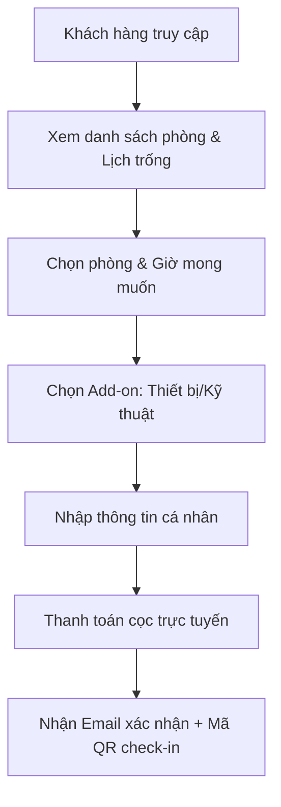

# TÀI LIỆU YÊU CẦU DỰ ÁN (PRD) - HỆ THỐNG DUO STUDIO BOOKING
**Vai trò**: Business Analyst Lead | **Phiên bản**: 1.0 | **Trạng thái**: Đã phê duyệt | **Thiết kế chủ đạo**: Minimalist Light (Trắng sáng)

---

## 1. Giới thiệu & Mục tiêu Dự án

### 1.1. Bối cảnh
DUO Studio là hệ thống chuỗi phòng quay phim, chụp ảnh, podcast chuyên nghiệp. Để tối ưu hóa quy trình vận hành và nâng cao trải nghiệm khách hàng, dự án xây dựng nền tảng **DUO Studio Booking Web Application** nhằm tự động hóa 90% quy trình đặt lịch phòng, quản lý thiết bị đi kèm và xử lý thanh toán trực tuyến.

### 1.2. Mục tiêu hệ thống
- **Đối với Khách hàng (Creators/Agencies/Brands)**: Cung cấp giao diện trực quan, tìm kiếm phòng trống theo thời gian thực (real-time availability), lựa chọn dịch vụ đi kèm và hoàn tất booking trong dưới 2 phút.
- **Đối với Ban vận hành (Admin/Kỹ thuật viên/CSKH)**: Tự động đồng bộ lịch đặt phòng, cảnh báo xung đột thiết bị, tự động hóa gửi thông báo (email/Zalo) và báo cáo doanh thu trực quan.

---

## 2. Định hướng Thiết kế & Giao diện (UI/UX Style Guide)

Hệ thống sẽ tuân thủ nghiêm ngặt phong cách **Minimalist Light (Trắng sáng)** nhằm tạo cảm giác cao cấp, sạch sẽ, rộng rãi và tôn vinh tối đa hình ảnh chất lượng cao của các phòng studio.

### 2.1. Bảng màu chủ đạo (Color Palette)
- **Nền chính (Primary Background)**: `#FFFFFF` (Trắng tinh khiết) và `#F8FAFC` (Slate-50 - dùng cho các phân vùng phụ để tạo chiều sâu).
- **Màu chữ chính (Primary Text)**: `#0F172A` (Slate-900) mang lại độ tương phản tuyệt hảo và cảm giác dễ đọc.
- **Màu chữ phụ (Secondary Text)**: `#475569` (Slate-600).
- **Màu nhấn thương hiệu (Accent Color)**: `#4F46E5` (Indigo-600) dùng cho các nút CTA quan trọng, chỉ báo trạng thái hoạt động hoặc các điểm nhấn viền tương tác.
- **Màu viền & Chia tách (Borders & Dividers)**: `#E2E8F0` (Slate-200) siêu mảnh (1px) tạo sự ngăn nắp, tinh tế.

### 2.2. Hiệu ứng thị giác (Visual & Micro-interactions)
- **Đổ bóng (Soft Shadows)**: Sử dụng các lớp đổ bóng rất nhẹ (`shadow-sm`, `shadow-md` với opacity cực thấp từ 4% - 6% màu chàm) để tạo cảm giác các khối nội dung nổi nhẹ trên nền trắng.
- **Glassmorphism (Kính mờ)**: Sử dụng hiệu ứng `backdrop-blur-md` kết hợp màu nền trắng mờ `rgba(255, 255, 255, 0.8)` trên Header/Navbar dính (sticky navbar).
- **Bo góc (Border Radius)**: Bo góc lớn chuẩn hiện đại (`rounded-2xl` - 1rem / 16px) cho các khung thẻ phòng, khối nhập liệu form và nút bấm.
- **Subtle Animations**: Hiệu ứng chuyển động mượt mà (transition duration 200ms) khi di chuột qua thẻ phòng (nổi nhẹ lên và ảnh phóng to 2%), nút bấm đổi màu từ indigo sang violet nhẹ.

---

## 3. Phân tích Yêu cầu Chức năng (Functional Requirements)

### 3.1. Phân hệ Khách hàng (Front-end Portal)

#### F-101: Tìm kiếm & Lọc phòng theo thời gian thực (Real-time Availability)
- **Mô tả**: Khách hàng chọn ngày, khung giờ (từ - đến), loại phòng (Podcast, Livestream, Concept). Hệ thống tự động lọc ra các phòng còn trống.
- **Quy tắc nghiệp vụ**: Khung giờ tối thiểu cho mỗi lượt đặt phòng là 1.5 giờ. Khoảng nghỉ giữa 2 lượt đặt liền kề tối thiểu là 15 phút để nhân viên dọn dẹp phòng (Buffer Time).

#### F-102: Lựa chọn Dịch vụ bổ sung (Add-ons Select)
- **Mô tả**: Khi chọn phòng, khách hàng có thể tích chọn thêm thiết bị (Đèn, Mic Shure SM7B, máy quay FX3) hoặc nhân sự hỗ trợ (Kỹ thuật viên âm thanh, chuyên viên ánh sáng).
- **Quy tắc nghiệp vụ**: Số lượng thiết bị add-on không được vượt quá số lượng tồn kho khả dụng tại chi nhánh đó trong khung giờ tương ứng.

#### F-103: Booking Engine & Tính toán chi phí thông minh
- **Mô tả**: Hệ thống tự động tính toán tổng chi phí dựa trên:
  - Giá thuê phòng theo giờ tương ứng (áp dụng giá ngày thường/cuối tuần/sau 22:00 nếu có).
  - Chi phí thiết bị thuê thêm (tính theo giờ hoặc theo buổi).
  - Khấu trừ mã giảm giá (Coupon/Promo Code).
  - Phí đặt cọc bắt buộc (thường là 50% hoặc 100% giá trị booking tùy loại phòng).

#### F-104: Cổng thanh toán tích hợp (Payment Gateway)
- **Mô tả**: Hỗ trợ thanh toán qua mã QR động (VietQR/Momo/ZaloPay) hoặc thẻ tín dụng.
- **Quy tắc nghiệp vụ**: Khách hàng có 10 phút để thực hiện giao dịch quét QR. Quá thời gian này mà hệ thống chưa nhận được webhook thông báo giao dịch thành công (IPN), lịch đặt phòng tạm thời đó sẽ tự động bị hủy để mở lại cho khách hàng khác.

#### F-105: Tra cứu lịch sử đặt phòng & Hủy lịch (Self-service Booking Management)
- **Mô tả**: Khách hàng tra cứu trạng thái booking bằng số điện thoại + OTP hoặc email.
- **Quy tắc nghiệp vụ**:
  - Hủy/đổi lịch trước 24 giờ: Hoàn cọc 100% vào tài khoản ví/ngân hàng.
  - Hủy/đổi lịch từ 12 - 24 giờ trước giờ thuê: Phạt 50% tiền cọc.
  - Hủy lịch dưới 12 giờ: Mất 100% tiền đặt cọc.

---

### 3.2. Phân hệ Quản lý & Vận hành (Admin / Host Portal)

#### F-201: Trang tổng quan điều hành (Interactive Calendar Dashboard)
- **Mô tả**: Giao diện dạng Lịch tuần/Lịch tháng (Scheduler View) hiển thị tất cả các phòng dạng dòng thời gian song song. 
- **Chức năng**:
  - Xem chi tiết booking khi click vào block giờ.
  - Kéo thả (drag-and-drop) để thay đổi giờ hoặc đổi phòng cho khách hàng (chỉ Admin mới có quyền).
  - Đánh dấu khóa phòng tạm thời để bảo trì thiết bị hoặc phục vụ nội bộ.

#### F-202: Quản lý Kho Thiết bị (Inventory Management & Conflict Prevention)
- **Mô tả**: Quản lý danh sách thiết bị có trong hệ thống và phân bổ thiết bị theo từng chi nhánh.
- **Quy tắc nghiệp vụ**: Khi một booking đặt trước thiết bị X, hệ thống sẽ trừ đi 1 đơn vị khả dụng của thiết bị X trong kho tại khung giờ đó. Nếu kho khả dụng bằng 0, thiết bị X sẽ tự động bị mờ (disabled) ở giao diện khách hàng.

#### F-203: Cấu hình giá động & Khuyến mãi (Dynamic Pricing Engine)
- **Mô tả**: Cấu hình giá phòng tăng thêm vào cuối tuần (Thứ 7, Chủ Nhật) hoặc khung giờ đêm (sau 22h). Tạo các chương trình giảm giá giờ vàng (Happy Hour) hoặc giảm giá theo số lượng giờ thuê dài hạn.

#### F-204: Báo cáo & Phân tích (Analytics & Reports)
- **Mô tả**: 
  - Biểu đồ doanh thu theo ngày/tuần/tháng/chi nhánh.
  - Thống kê tỷ lệ lấp đầy phòng (Occupancy Rate) để tối ưu hóa chiến dịch marketing.
  - Thống kê thiết bị được thuê nhiều nhất.

---

## 4. Yêu cầu Phi chức năng (Non-functional Requirements)

### 4.1. Hiệu năng & Khả năng mở rộng (Performance & Scalability)
- **Tốc độ tải trang**: Dưới 1.5 giây đối với trang chủ và trang chi tiết phòng (đạt điểm số Google Lighthouse Core Web Vitals tối thiểu từ 90 điểm trở lên).
- **Khả năng chịu tải**: Hệ thống chịu tải tối thiểu 10,000 lượt truy cập đồng thời (CCU) mà không gây chậm trễ trong quá trình truy vấn lịch trống hoặc thanh toán.
- **Static Site Generation (SSG)**: Các trang landing page tĩnh giới thiệu phòng được build tĩnh trước để đảm bảo tốc độ tải tức thì.

### 4.2. Bảo mật & An toàn dữ liệu (Security)
- **Mã hóa kết nối**: Bắt buộc sử dụng giao thức HTTPS toàn bộ hệ thống.
- **Bảo mật thanh toán**: Không lưu trữ trực tiếp thông tin thẻ của khách hàng trên database. Mọi giao dịch phải thông qua cổng thanh toán được chứng nhận PCI-DSS.
- **Phòng chống tấn công**: Tích hợp các cơ chế chống Spam Booking (Rate Limiting tối đa 3 yêu cầu gửi OTP/phút trên một số điện thoại).

### 4.3. Độ tin cậy & Sẵn sàng (Reliability)
- **Thời gian hoạt động liên tục (Uptime)**: Đạt tối thiểu 99.9%.
- **Sao lưu dữ liệu**: Database được tự động backup định kỳ hàng ngày vào lúc 02:00 sáng.

---

## 5. Danh mục các Tích hợp Hệ thống (Integrations)

| Tên hệ thống | Phương thức | Mục đích |
| :--- | :--- | :--- |
| **Cổng thanh toán (PayOS / MoMo)** | API / Webhook | Tạo mã QR thanh toán động và nhận trạng thái thanh toán tự động để kích hoạt xác nhận booking. |
| **Google Calendar API** | OAuth 2.0 / API | Đồng bộ tự động lịch đặt phòng của hệ thống lên lịch làm việc của đội ngũ kỹ thuật viên tại chi nhánh. |
| **Zalo ZNS / Twilio SendGrid** | REST API | Gửi tin nhắn SMS/Zalo hoặc Email tự động cho khách hàng khi: Đặt lịch thành công, nhắc nhở trước giờ quay 2 tiếng, gửi hóa đơn điện tử. |

---

## 6. Thiết kế Cơ sở Dữ liệu sơ bộ (Database Schema Concept)

### 6.1. Bảng `studios` (Thông tin phòng)
- `id` (UUID, Primary Key)
- `name` (Varchar): Tên phòng
- `slug` (Varchar, Unique): Đường dẫn tĩnh
- `description` (Text): Mô tả
- `price_per_hour` (Decimal): Đơn giá/giờ
- `capacity` (Integer): Sức chứa tối đa
- `status` (Enum: active, maintenance, inactive)

### 6.2. Bảng `bookings` (Thông tin đặt lịch)
- `id` (UUID, Primary Key)
- `studio_id` (UUID, Foreign Key)
- `customer_name` (Varchar)
- `customer_phone` (Varchar)
- `customer_email` (Varchar)
- `start_time` (Timestamp)
- `end_time` (Timestamp)
- `total_price` (Decimal)
- `deposit_amount` (Decimal): Tiền cọc đã thanh toán
- `payment_status` (Enum: unpaid, partially_paid, fully_paid, refunded)
- `booking_status` (Enum: pending, confirmed, check_in, completed, cancelled)

### 6.3. Bảng `booking_addons` (Dịch vụ đi kèm của mỗi lượt đặt)
- `booking_id` (UUID, Foreign Key)
- `equipment_id` (UUID, Foreign Key)
- `quantity` (Integer)
- `price_at_booking` (Decimal): Lưu lại giá tại thời điểm đặt đề phòng thay đổi giá sau này.
